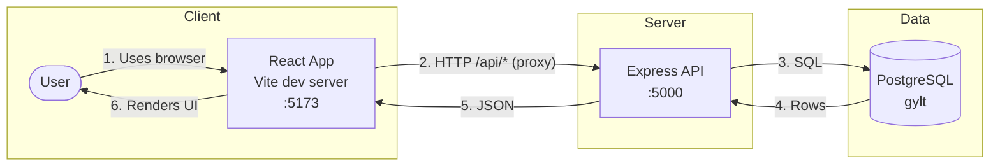

# GYLT — Get Your Life Together

## App Summary

GYLT is a financial education web application that helps users build better money habits. The app addresses the need for approachable, structured financial literacy by offering goal tracking, short lessons, and section-based quizzes. The primary user is someone who wants to improve their financial knowledge and track progress (e.g., saving, credit, budgeting, investing). Users can view goals with step checklists, read lessons grouped by section (e.g., Financial Foundations, Building Wealth), take multiple-choice quizzes per section, and see progress (e.g., quiz completion and scores). All progress is stored in a database so it persists across sessions. The product is a full-stack vertical slice: the React frontend talks to an Express API, which reads and writes to PostgreSQL.

## Tech Stack

| Layer | Technologies |
|-------|--------------|
| **Frontend** | React 18, Vite, Tailwind CSS, Lucide React |
| **Backend** | Node.js, Express, CORS, dotenv |
| **Database** | PostgreSQL, `pg` (node-postgres) |
| **Authentication** | None (single default user for demo) |
| **External services / APIs** | None |

## Architecture Diagram



- **1.** User opens the app in the browser.  
- **2.** Frontend sends requests to `/api/*`; Vite proxies them to the backend.  
- **3.** Backend runs SQL (via `pg`) against PostgreSQL.  
- **4–5.** Database returns data; backend responds with JSON.  
- **6.** Frontend updates the UI from the API response.

## Prerequisites

Install and verify the following before running the project locally.

| Software | Purpose | Install | Verify |
|----------|---------|---------|--------|
| **Node.js** (v18+) | Runtime for frontend and backend | [nodejs.org](https://nodejs.org/) | `node -v` |
| **npm** | Package manager | Bundled with Node.js | `npm -v` |
| **PostgreSQL** (v12+) | Database | [postgresql.org/download](https://www.postgresql.org/download/) | `psql --version` |
| **psql** in PATH | Run schema and seed scripts | Included with PostgreSQL | `psql -d postgres -c "SELECT 1"` |

- Make sure `psql` can connect with a role that can create databases: `psql -d postgres -c "SELECT current_user;"`

## Installation and Setup

### 1. Clone and install dependencies

```bash
# From the project root
cd backend
npm install

cd ../frontend
npm install
```

### 2. Create the database

Use a PostgreSQL role that can create databases.

First, confirm which role your `psql` session is using:

```bash
psql -d postgres -c "SELECT current_user;"
```

Then create the database (safe to rerun):

```bash
psql -d postgres -c "DROP DATABASE IF EXISTS gylt;"
psql -d postgres -c "CREATE DATABASE gylt;"
```

If your setup requires an explicit user, add `-U <your_pg_user>` to the commands above.

Format:

```bash
psql -U <your_pg_user> -d <database_name> <rest_of_command>
```

Example:

```bash
psql -U postgres -d gylt -f db/schema.sql
```

### 3. Run schema and seed

From the project root:

```bash
psql -d gylt -f db/schema.sql
psql -d gylt -f db/seed.sql
```

If needed, add `-U <your_pg_user>`.

### 4. Configure environment variables

```bash
# From project root
cp .env.example backend/.env
```

Edit `backend/.env` and set your PostgreSQL credentials:

- `DB_USER` — PostgreSQL username (use the role from `SELECT current_user;`)
- `DB_HOST` — usually `localhost`
- `DB_NAME` — `gylt`
- `DB_PASSWORD` — your PostgreSQL password
- `DB_PORT` — usually `5432`
- `PORT` — backend port (default `5000`)

## Running the Application

1. **Start the backend** (Terminal 1):

   ```bash
   cd backend
   npm start
   ```

   You should see something like: `Server is running on port 5000` and `Connected to PostgreSQL database`.

2. **Start the frontend** (Terminal 2):

   ```bash
   cd frontend
   npm run dev
   ```

3. **Open in the browser:**  
   [http://localhost:5173](http://localhost:5173)

The frontend proxies `/api` to the backend; keep both servers running while using the app.

## Verifying the Vertical Slice

This demonstrates the full path: **UI → API → database → persistence**.

### Step 1: Complete a quiz

1. Open [http://localhost:5173](http://localhost:5173).
2. Go to the **Quizzes** tab.
3. Under any section (e.g. “Section 1: Financial Foundations”), click a quiz (e.g. “Quiz: Financial Foundations”).
4. Answer all questions and click through to the end.
5. On the results screen, note your **score** (e.g. “You scored 4 out of 6 (67%)”).
6. Click **Back to Quiz List**.

### Step 2: Confirm the database was updated

Using the same PostgreSQL user and database as in setup:

```bash
psql -d gylt -c "SELECT user_id, quiz_id, score, total_questions, completed_at FROM quizzes_completed ORDER BY completed_at DESC LIMIT 5;"
```

If needed, add `-U <your_pg_user>`.

You should see a row for the quiz you just completed (e.g. `user_id=1`, `quiz_id=1`, your `score` and `total_questions`).

### Step 3: Confirm the change persists after refresh

1. In the browser, refresh the page (F5 or Ctrl+R).
2. Go to **Quizzes** again.
3. The same quiz should still show your previous score (e.g. “Score: 67%”) and the overall progress (e.g. “Your Progress: 33%” or “1 of 3 quizzes completed”) should reflect the saved result.

This shows that completing a quiz updates the database and that the frontend reads that data on load, confirming the vertical slice from UI through backend to PostgreSQL.
